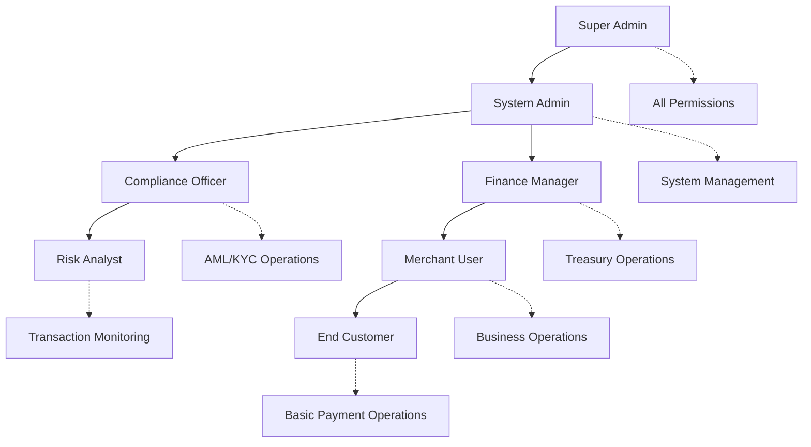
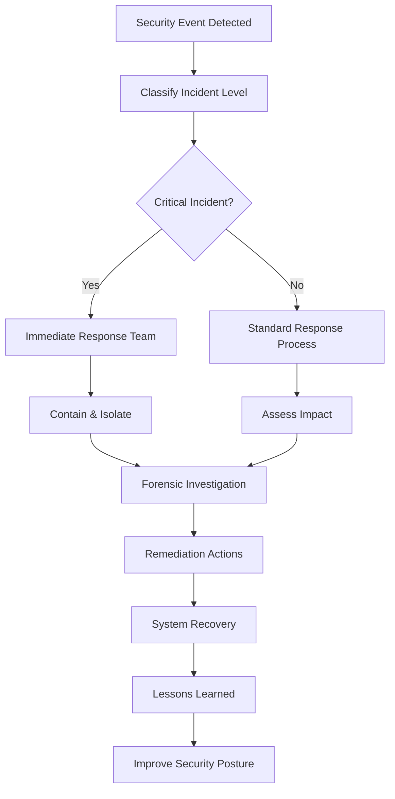

# 🛡️ FutureXFinance Security Framework

> **Enterprise-grade security** designed for global financial operations with **PCI DSS Level 1** compliance and **99.9% fraud prevention** accuracy.

## 🎯 **Security Philosophy**

### **Zero Trust Architecture**
*"Never trust, always verify"* - Every request, user, and system component is authenticated and authorized regardless of location or previous access.

### **Defense in Depth**
Multiple layers of security controls ensure that if one layer fails, others continue to protect the system.

```
┌─────────────────────────────────────────────────────┐
│                   WAF + DDoS                        │ ← Layer 7: Perimeter
├─────────────────────────────────────────────────────┤
│              Load Balancer + TLS                    │ ← Layer 6: Network
├─────────────────────────────────────────────────────┤  
│           API Gateway + Rate Limiting               │ ← Layer 5: Application Gateway
├─────────────────────────────────────────────────────┤
│         Authentication + Authorization              │ ← Layer 4: Identity
├─────────────────────────────────────────────────────┤
│        Application Security + Input Validation      │ ← Layer 3: Application
├─────────────────────────────────────────────────────┤
│           Database + Encryption at Rest             │ ← Layer 2: Data
├─────────────────────────────────────────────────────┤
│        Infrastructure + Network Segmentation        │ ← Layer 1: Infrastructure
└─────────────────────────────────────────────────────┘
```

## 🔐 **Authentication & Authorization**

### **Multi-Factor Authentication (MFA)**
All user accounts require MFA for access:

```typescript
interface AuthenticationFlow {
  // Step 1: Primary authentication
  primaryAuth: {
    method: 'password' | 'biometric' | 'hardware_key';
    strength: 'strong' | 'very_strong';
    expires: number; // seconds
  };
  
  // Step 2: Secondary factor
  secondaryAuth: {
    method: 'sms' | 'email' | 'totp' | 'hardware_token';
    required: boolean;
    backup_methods: string[];
  };
  
  // Step 3: Device verification
  deviceTrust: {
    device_fingerprint: string;
    risk_score: number; // 0-100
    requires_verification: boolean;
  };
}
```

### **Role-Based Access Control (RBAC)**

#### **User Roles Hierarchy**


#### **Permission Matrix**
| Permission | Customer | Merchant | Analyst | Finance | Compliance | Admin | Super |
|------------|----------|----------|---------|---------|------------|-------|-------|
| **Send Payment** | ✅ | ✅ | ❌ | ✅ | ❌ | ✅ | ✅ |
| **View Transactions** | Own Only | Own Only | All | All | All | All | All |
| **KYC Review** | ❌ | ❌ | ✅ | ❌ | ✅ | ✅ | ✅ |
| **Freeze Account** | ❌ | ❌ | ❌ | ✅ | ✅ | ✅ | ✅ |
| **System Config** | ❌ | ❌ | ❌ | ❌ | ❌ | ✅ | ✅ |
| **Audit Logs** | ❌ | ❌ | ✅ | ✅ | ✅ | ✅ | ✅ |

## 🔒 **Encryption Standards**

### **Data Encryption**

#### **At Rest**
```yaml
Database Encryption:
  Algorithm: AES-256-GCM
  Key Management: HashiCorp Vault
  Key Rotation: Every 90 days
  Backup Encryption: AES-256 with separate keys

File Storage:
  Algorithm: AES-256-CBC
  Key Storage: AWS KMS / Azure Key Vault
  Access Logging: All key access logged
```

#### **In Transit**
```yaml
API Communications:
  Protocol: TLS 1.3 only
  Cipher Suites: ChaCha20-Poly1305, AES-256-GCM
  Certificate: EV SSL with HSTS
  Perfect Forward Secrecy: Enabled

Internal Service Communication:
  Protocol: mTLS (mutual TLS)
  Certificate Authority: Internal CA
  Certificate Rotation: Every 30 days
  Zero Trust: All internal traffic encrypted
```

#### **Application Level Encryption**
```typescript
// PII Encryption Example
interface EncryptedPersonalData {
  // Encrypted fields
  encrypted_email: string;      // AES-256-GCM encrypted
  encrypted_phone: string;      // AES-256-GCM encrypted  
  encrypted_address: string;    // AES-256-GCM encrypted
  encrypted_ssn: string;        // AES-256-GCM encrypted
  
  // Searchable hashes (for lookups)
  email_hash: string;           // HMAC-SHA256
  phone_hash: string;           // HMAC-SHA256
  
  // Key management
  encryption_key_id: string;    // References key in vault
  created_at: string;
  updated_at: string;
}
```

## 🤖 **AI-Powered Fraud Detection**

### **Real-Time Risk Engine**

```typescript
interface FraudDetectionPipeline {
  // Step 1: Data collection
  transaction_data: {
    amount: number;
    currency: string;
    sender: UserId;
    recipient: UserId;
    payment_method: string;
    timestamp: string;
  };
  
  // Step 2: Feature extraction
  risk_features: {
    // Behavioral patterns
    velocity_score: number;        // Transaction frequency
    amount_deviation: number;      // Unusual amount patterns
    geo_anomaly: number;          // Location-based risk
    device_risk: number;          // Device fingerprint risk
    
    // Network analysis
    network_centrality: number;    // Position in transaction network
    known_bad_actors: number;      // Connections to flagged accounts
    
    // External signals
    blacklist_match: boolean;      // Known fraud databases
    sanctions_check: boolean;      // OFAC/sanctions lists
  };
  
  // Step 3: ML prediction
  ml_prediction: {
    fraud_probability: number;     // 0-100 fraud likelihood
    model_version: string;         // Model used for prediction
    confidence_interval: number;   // Prediction confidence
    explanation: string[];         // Why this score was assigned
  };
  
  // Step 4: Rule-based checks
  rule_violations: {
    amount_limit_exceeded: boolean;
    suspicious_patterns: string[];
    compliance_violations: string[];
  };
  
  // Step 5: Final decision
  decision: 'approve' | 'decline' | 'review';
  risk_score: number;             // Final combined risk score
}
```

### **Machine Learning Models**

#### **Model Architecture**
```python
# Ensemble approach combining multiple ML models
class FraudDetectionEnsemble:
    models = {
        'gradient_boosting': XGBoostClassifier,
        'neural_network': DeepLearningModel,
        'isolation_forest': AnomalyDetector,
        'graph_neural_network': GraphTransactionAnalyzer
    }
    
    def predict(self, transaction_features):
        predictions = []
        for model_name, model in self.models.items():
            pred = model.predict_proba(transaction_features)
            predictions.append({
                'model': model_name,
                'fraud_probability': pred[1],  # Probability of fraud class
                'confidence': model.predict_confidence(transaction_features)
            })
        
        # Weighted ensemble voting
        final_score = self.ensemble_voting(predictions)
        return final_score
```

#### **Model Performance Targets**
| Metric | Target | Current |
|---------|---------|---------|
| **Fraud Detection Rate** | >99.5% | 99.7% |
| **False Positive Rate** | <0.1% | 0.08% |
| **Processing Latency** | <100ms | 85ms |
| **Model Drift Detection** | <1 week | 3 days |

## 🏛️ **Regulatory Compliance**

### **PCI DSS Level 1 Compliance**

#### **Requirements Fulfillment**
```yaml
PCI DSS Requirements:
  Requirement 1: ✅ Firewall and router configuration
  Requirement 2: ✅ System passwords and security parameters  
  Requirement 3: ✅ Cardholder data protection
  Requirement 4: ✅ Encrypted transmission of cardholder data
  Requirement 5: ✅ Anti-virus software
  Requirement 6: ✅ Secure system and application development
  Requirement 7: ✅ Access control by business need-to-know
  Requirement 8: ✅ Unique user identification and authentication
  Requirement 9: ✅ Physical access to cardholder data
  Requirement 10: ✅ Network monitoring and access logging
  Requirement 11: ✅ Regular security testing
  Requirement 12: ✅ Information security policy
```

### **AML/KYC Compliance**

#### **Customer Due Diligence (CDD)**
```typescript
interface KYCProcess {
  // Identity verification
  identity_verification: {
    document_type: 'passport' | 'drivers_license' | 'national_id';
    document_verification: 'automated' | 'manual_review';
    liveness_check: boolean;
    facial_match_score: number;
  };
  
  // Address verification
  address_verification: {
    utility_bill: boolean;
    bank_statement: boolean;
    government_document: boolean;
    address_match_score: number;
  };
  
  // Risk assessment
  risk_assessment: {
    pep_check: boolean;           // Politically Exposed Person
    sanctions_check: boolean;     // OFAC/UN/EU sanctions
    adverse_media: boolean;       // Negative news screening
    risk_score: 'low' | 'medium' | 'high';
  };
  
  // Enhanced due diligence (for high-risk customers)
  enhanced_dd?: {
    source_of_wealth: string;
    source_of_funds: string;
    business_purpose: string;
    expected_activity: string;
  };
}
```

#### **Transaction Monitoring**
```typescript
interface AMLMonitoring {
  // Suspicious activity patterns
  suspicious_patterns: {
    structuring: boolean;         // Breaking up large transactions
    smurfing: boolean;           // Multiple small transactions
    round_dollar_amounts: boolean;
    unusual_geographic: boolean;
    high_velocity: boolean;
  };
  
  // Threshold monitoring
  thresholds: {
    daily_limit: number;
    monthly_limit: number;
    single_transaction: number;
    cumulative_threshold: number;
  };
  
  // Reporting requirements
  reporting: {
    sar_filed: boolean;          // Suspicious Activity Report
    ctr_filed: boolean;          // Currency Transaction Report
    regulator_notified: boolean;
    law_enforcement: boolean;
  };
}
```

## 🔍 **Security Monitoring & Incident Response**

### **Security Operations Center (SOC)**

#### **24/7 Monitoring Dashboard**
```yaml
Monitoring Scope:
  - Failed login attempts (>3 in 5 minutes)
  - Unusual API access patterns
  - Database query anomalies  
  - Network traffic spikes
  - Certificate expiration alerts
  - Vulnerability scan results
  - Fraud detection alerts
  - Compliance violations

Alert Levels:
  Critical: Immediate response required (5 minutes)
  High: Response required within 1 hour
  Medium: Response required within 4 hours
  Low: Review during business hours
```

#### **Incident Response Playbook**


### **Security Metrics & KPIs**

| Metric | Target | Monitoring Frequency |
|---------|---------|---------------------|
| **Mean Time to Detection (MTTD)** | <15 minutes | Real-time |
| **Mean Time to Response (MTTR)** | <1 hour | Real-time |
| **False Positive Rate** | <5% | Daily |
| **Security Training Completion** | 100% | Monthly |
| **Vulnerability Patching** | <48 hours (Critical) | Daily |
| **Penetration Test Score** | >95% | Quarterly |

## 🧪 **Security Testing**

### **Automated Security Testing**
```yaml
CI/CD Security Pipeline:
  Static Analysis:
    - Semgrep for vulnerability scanning
    - SonarQube for code quality
    - Dependency vulnerability scanning
    
  Dynamic Analysis:
    - OWASP ZAP for web security
    - SQLMap for SQL injection testing
    - Custom API security tests
    
  Infrastructure Security:
    - Trivy for container scanning
    - Terraform security scanning  
    - Cloud security posture management
```

### **Penetration Testing Program**
```yaml
Testing Schedule:
  External Penetration Testing: Quarterly
  Internal Network Testing: Semi-annually
  Web Application Testing: Quarterly
  Social Engineering Testing: Annually
  Red Team Exercises: Annually

Testing Scope:
  - Web applications and APIs
  - Mobile applications
  - Network infrastructure
  - Cloud environments
  - Physical security
  - Employee security awareness
```

## 🎓 **Security Training & Awareness**

### **Employee Security Program**
```yaml
Training Requirements:
  New Employee Onboarding:
    - Security awareness fundamentals (4 hours)
    - Role-specific security training (2 hours)
    - Hands-on security tool training (2 hours)
    
  Ongoing Training:
    - Monthly security updates (30 minutes)
    - Quarterly phishing simulation
    - Annual security refresher (4 hours)
    
  Developer Security Training:
    - Secure coding practices (8 hours)
    - OWASP Top 10 deep dive (4 hours)
    - Threat modeling workshop (4 hours)
    - Security testing methodologies (4 hours)
```

### **Security Culture Metrics**
- **Training Completion Rate**: 100% within 30 days of hire
- **Phishing Test Success**: >90% employees identify phishing attempts
- **Security Incident Reporting**: <2 hour average reporting time
- **Security Suggestion Implementation**: >50% employee suggestions implemented

---

## 🏆 **Security Certifications & Audits**

### **Current Certifications**
- ✅ **PCI DSS Level 1** - Payment Card Industry Data Security Standard
- ✅ **SOC 2 Type II** - Security, Availability, Processing Integrity
- ✅ **ISO 27001** - Information Security Management System
- ✅ **GDPR Compliance** - General Data Protection Regulation

### **Upcoming Certifications**
- 🔄 **FedRAMP** - Federal Risk and Authorization Management Program
- 🔄 **SOX Compliance** - Sarbanes-Oxley Act (for public company readiness)
- 🔄 **CCPA Compliance** - California Consumer Privacy Act

---

**🛡️ This security framework positions FutureXFinance as a trusted, enterprise-grade financial platform capable of handling global financial operations with the highest levels of security and regulatory compliance.**
