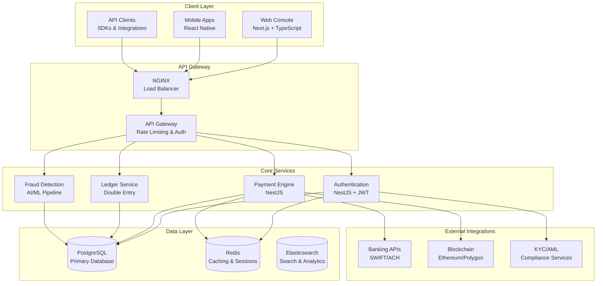
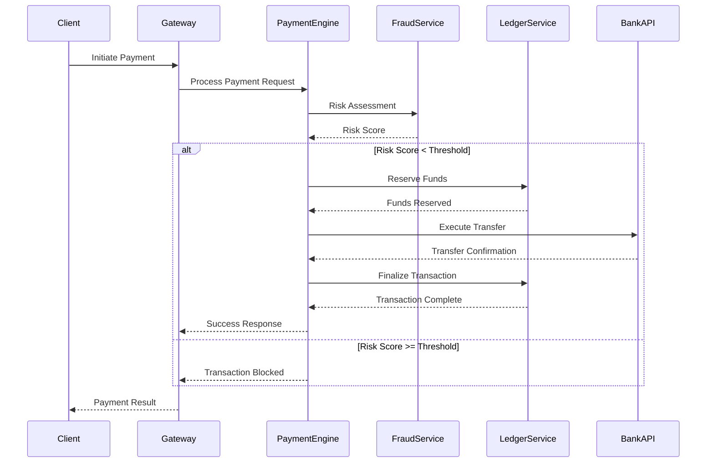
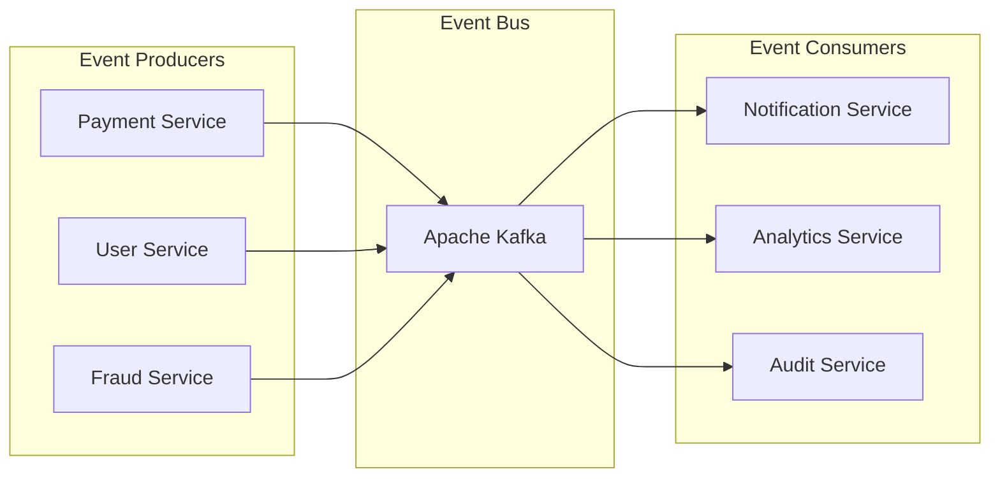

# 🏗️ FutureXFinance System Architecture

## 🎯 **Enterprise Architecture Overview**

FutureXFinance follows a **microservices architecture** designed for scalability, security, and global financial operations.



## 🏛️ **Core Technology Stack**

### **Frontend Layer**
| Component | Technology | Purpose |
|-----------|------------|---------|
| **Web Console** | Next.js 14 + TypeScript | Merchant/operator dashboard |
| **Design System** | Tailwind CSS + Radix UI | Consistent UI components |
| **State Management** | Zustand | Client state management |
| **Real-time** | WebSockets + Server-Sent Events | Live transaction updates |

### **Backend Services**
| Service | Technology | Responsibility |
|---------|------------|----------------|
| **API Gateway** | NestJS + Express | Request routing, authentication |
| **Payment Engine** | NestJS + TypeScript | Transaction processing |
| **Ledger Service** | PostgreSQL + Custom Logic | Double-entry bookkeeping |
| **Fraud Detection** | Python + TensorFlow | AI-powered risk assessment |
| **Notification Service** | NestJS + Bull Queue | Email, SMS, push notifications |

### **Data Infrastructure**
| Component | Technology | Use Case |
|-----------|------------|----------|
| **Primary Database** | PostgreSQL 15 | Transaction data, user accounts |
| **Caching Layer** | Redis 7 | Session storage, API caching |
| **Search Engine** | Elasticsearch 8 | Transaction search, analytics |
| **Message Queue** | Redis + Bull | Async job processing |
| **Time Series** | TimescaleDB | Financial metrics, monitoring |

## 🔐 **Security Architecture**

### **Defense in Depth**
```
┌─────────────────┐
│   WAF + CDN     │ ← DDoS Protection, Geo-blocking
├─────────────────┤
│  Load Balancer  │ ← SSL Termination, Health Checks  
├─────────────────┤
│  API Gateway    │ ← Rate Limiting, JWT Validation
├─────────────────┤
│  Microservices  │ ← Service-to-Service Auth (mTLS)
├─────────────────┤
│   Database      │ ← Encryption at Rest, Network Isolation
└─────────────────┘
```

### **Security Components**
- **Authentication**: OAuth 2.0 + OIDC with MFA
- **Authorization**: RBAC with fine-grained permissions  
- **Encryption**: AES-256 at rest, TLS 1.3 in transit
- **Key Management**: HashiCorp Vault for secrets
- **Fraud Detection**: Real-time ML models for risk scoring

## 💳 **Payment Processing Flow**



## 📊 **Data Architecture**

### **Database Design Principles**
1. **ACID Compliance**: All financial transactions are ACID-compliant
2. **Event Sourcing**: Immutable transaction log for audit trails
3. **Data Partitioning**: Tables partitioned by date for performance
4. **Encryption**: PII encrypted with application-level encryption

### **Core Data Models**

#### **Users & Accounts**
```sql
-- Users table with PII encryption
CREATE TABLE users (
    id UUID PRIMARY KEY,
    email_hash VARCHAR(64) UNIQUE,
    encrypted_email TEXT,
    encrypted_phone TEXT,
    created_at TIMESTAMP,
    updated_at TIMESTAMP
);

-- Account balances with precision
CREATE TABLE accounts (
    id UUID PRIMARY KEY,
    user_id UUID REFERENCES users(id),
    currency VARCHAR(3),
    balance_cents BIGINT, -- Stored in smallest unit
    available_cents BIGINT,
    created_at TIMESTAMP
);
```

#### **Double-Entry Ledger**
```sql
-- Immutable transaction ledger
CREATE TABLE ledger_entries (
    id UUID PRIMARY KEY,
    transaction_id UUID,
    account_id UUID REFERENCES accounts(id),
    amount_cents BIGINT,
    entry_type VARCHAR(6) CHECK (entry_type IN ('DEBIT', 'CREDIT')),
    description TEXT,
    created_at TIMESTAMP IMMUTABLE
);
```

## 🚀 **Scalability & Performance**

### **Horizontal Scaling Strategy**
- **Microservices**: Each service scales independently
- **Database Sharding**: User data sharded by geography
- **CDN**: Global content delivery for static assets
- **Caching**: Multi-layer caching strategy (L1: Redis, L2: Application)

### **Performance Targets**
| Metric | Target | Monitoring |
|--------|---------|------------|
| **API Response Time** | < 200ms (P95) | Prometheus + Grafana |
| **Database Query Time** | < 50ms (P95) | PostgreSQL logs |
| **Payment Processing** | < 3 seconds | Custom metrics |
| **Fraud Detection** | < 100ms | ML pipeline metrics |

## 🔄 **Event-Driven Architecture**

### **Event Streaming**


### **Event Types**
- **payment.initiated** - Payment request received
- **payment.completed** - Payment successfully processed
- **payment.failed** - Payment processing failed
- **fraud.detected** - Suspicious activity identified
- **user.created** - New user registration
- **compliance.alert** - AML/KYC compliance issue

## 🌍 **Global Infrastructure**

### **Multi-Region Deployment**
```
┌─────────────┐    ┌─────────────┐    ┌─────────────┐
│   US-East   │    │   EU-West   │    │  Asia-Pac   │
│             │    │             │    │             │
│  Primary    │◄──►│  Secondary  │◄──►│  Secondary  │
│  Region     │    │  Region     │    │  Region     │
└─────────────┘    └─────────────┘    └─────────────┘
        │                   │                   │
        └─────────┬─────────┴─────────┬─────────┘
                  │                   │
            ┌─────────────┐    ┌─────────────┐
            │   Backup    │    │  Disaster   │
            │   Storage   │    │  Recovery   │
            └─────────────┘    └─────────────┘
```

### **Infrastructure Components**
- **Container Orchestration**: Kubernetes with auto-scaling
- **Service Mesh**: Istio for service-to-service communication
- **Monitoring**: Prometheus, Grafana, Jaeger for distributed tracing
- **CI/CD**: GitHub Actions with blue-green deployments

---

## 📈 **Architecture Evolution**

### **Current State (v1.0)**
- Monolithic database with microservices
- Single-region deployment
- Basic fraud detection

### **Next Phase (v2.0)**
- Database per service (database-per-service pattern)
- Multi-region active-active setup
- Advanced ML fraud detection

### **Future Vision (v3.0)**
- Event sourcing with CQRS
- Blockchain integration for settlement
- Real-time global payment rails

---

**🏗️ This architecture supports FutureXFinance's mission to become the foundational layer of global finance, built for scale, security, and regulatory compliance.**
